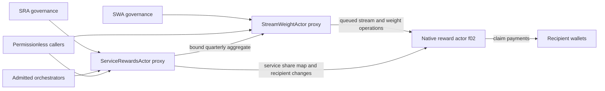

# Independent review guide

## Purpose

This document gives a new reviewer enough system context to begin an independent security and correctness review. It intentionally contains no prior review findings, severity judgments, suspected defects, or conclusions. Review the implementation and specifications directly and record conclusions independently.

The review target is the checked-out repository state. Pin the commit hash in the final report, and separately pin every external specification or implementation revision used as evidence.

## Start here

1. Read the accepted [FIP-0118](https://github.com/filecoin-project/FIPs/blob/master/FIPS/fip-0118.md) for the protocol model and terminology.
2. Read [FIPs PR #1286](https://github.com/filecoin-project/FIPs/pull/1286) for pending clarifications. At the time this guide was prepared it was open at `7897ef0c1ea5cc95fb5ebf83b11c51a2eb4c3a9a`; re-check its status and head before relying on it.
3. Read `src/ServiceRewardsActor.sol` and `src/StreamWeightActor.sol` before their tests.
4. Read `src/lib/UnanimousGovernance.sol`, `src/lib/UnanimousProxied.sol`, and `src/lib/Owners.sol` as one governance subsystem.
5. Read `src/lib/FVMRewards.sol`, `src/lib/FVMRewardMethod.sol`, and `src/lib/FVMRewardTypes.sol` as one FEVM/native-actor boundary.
6. Compare the wire contract with the corresponding revision of [builtin-actors PR #1782](https://github.com/filecoin-project/builtin-actors/pull/1782). At guide preparation, the referenced head was `faa3a01657bdd2c2dccd6e3c2c5b0d8e9d72489b`; re-pin it for the review.
7. Use tests to understand intended edge behavior only after deriving expected behavior from the specification and code.

Do not treat an open PR, a code comment, a mock, or `docs/f02-design.md` as independently authoritative. When sources disagree, document the exact revisions and resolve the intended baseline with maintainers before classifying behavior.

## System model

FIP-0118 divides each block reward into weighted streams:

- `w1`: consensus stream, paid to the winning miner;
- `w2`: service stream, allocated among Service Orchestrator wallets;
- `w0`: residual burn stream, defined by the remaining weight.

This repository implements two upgradeable Solidity contracts that control parts of that mechanism. The contracts do not implement the native reward actor itself.

### Stream Weight Actor (SWA)

`src/StreamWeightActor.sol` governs f02 stream configuration and advances the service-stream volume gate.

- `registerStream`, `removeStream`, `setWeightRecords`, and `setDistribution` require unanimous SWA-owner approval. The Solidity call has no local hold; f02 queues the resulting operation under its native hold.
- `cancelPending` and `cancelPendingWeight` are immediate actions available to any one SWA owner.
- `quarterlyGateCheck` is permissionless. It reads a bound quarterly aggregate from SRA and may queue a service-weight step in f02.
- `setGateParams` requires unanimity and the Solidity-side hold.
- UUPS upgrades are authorized through the same held unanimous mechanism.

The gate begins from the state initialized in `src/lib/GateParams.sol`. Its threshold is `base × stepRatio^steps`; a successful check advances one service-weight step until the configured step limit.

### Service Rewards Actor (SRA)

`src/ServiceRewardsActor.sol` manages Service Orchestrator identity, pair attribution, quarterly Filecoin Pay Volume, and the service-stream share map. Its source-level contract states that it never receives or holds value.

Caller classes:

| Caller | Operations |
|---|---|
| SRA owners, unanimous and no hold | admit/remove orchestrators, replace wallets, reassign bindings, update emitted policy lists/parameters, correct quarterly volume |
| Admitted orchestrator | register payer/operator pairs, cancel its own binding, post its quarterly volume |
| Any caller | submit a bound quarter's shares; read aggregate and registry views |
| UUPS upgrade caller | held unanimous SRA governance path |

Quarter lifecycle:

1. The quarter start is `activationEpoch + q × epochsPerQuarter`.
2. During the posting period, admitted orchestrators post nonzero 18-decimal USD volume.
3. During the verification window, SRA governance may replace or clear a posted value.
4. After posting plus verification, the quarter is bound.
5. Any caller may submit the latest bound quarter. SRA computes proportional shares and calls f02 `SetShares` for service stream ID `2`.
6. SWA's permissionless gate check consumes bound aggregate volume in quarter order.

SRA keeps two rotating per-orchestrator volume mirrors plus a persistent aggregate by quarter. Orchestrator IDs are monotonic and are distinct from the current orchestrator address and payout wallet.

### Native reward actor boundary

`src/lib/FVMRewards.sol` constructs DAG-CBOR tuples and invokes actor ID `2` through the FEVM `CallActorByID` precompile. It covers stream registration/removal, weight records, distribution writers, pending-operation cancellation, shares, recipient replacement, and claims.

Review this as a cross-language protocol boundary:

- Solidity ABI types versus Rust actor parameter types;
- signed and unsigned width restrictions;
- DAG-CBOR tuple length, field order, integer canonicalization, and address encoding;
- method numbers and actor IDs;
- immediate versus queued application;
- native exit codes, return codecs, malformed returns, and precompile failure;
- authorization enforced by Solidity versus authorization enforced by f02;
- state and event behavior on every success and failure outcome.

`docs/f02-design.md` explains the local design history and storage/accounting model. The network actor implementation and the deployed bundle remain the integration truth.

## Domain vocabulary

| Term | Meaning in this repository |
|---|---|
| Epoch | Filecoin chain epoch, represented by `uint64`; `currentEpoch()` reads `block.number` |
| Quarter `q` | Zero-based reporting interval anchored at SRA activation |
| Posting period | Initial part of a quarter's processing timeline in which an orchestrator posts volume for `q` |
| Verification window | Governance correction interval following posting |
| Bound quarter | Quarter whose posting and verification intervals have elapsed |
| Filecoin Pay Volume / FPV | USD-denominated 18-decimal volume attributed to one orchestrator for one quarter |
| Aggregated FPV | Sum recorded for a quarter and exposed by SRA to SWA |
| Orchestrator | Admitted service operator identity |
| Wallet | Current f02 payout recipient associated with an orchestrator identity |
| Binding | Unique `(payer, operator)` pair attributed to an orchestrator |
| Service stream | Explicit f02 stream with fixed ID `2` |
| Writer | Address authorized by f02 to update an explicit stream's share map |
| Weight record | Clamped linear stream-weight schedule `(vStart, slope, tStart, floor, cap)` |
| Hold | Delay between unanimous authorization and permissionless completion, either in Solidity or f02 depending on the operation |
| Pending task | Solidity governance approval state keyed by a task ID, normally `keccak256(msg.data)` |
| Pending write | Native f02 operation queued for a future effective epoch |

## External references

- [Accepted FIP-0118](https://github.com/filecoin-project/FIPs/blob/master/FIPS/fip-0118.md)
- [FIP-0118 discussion #1249](https://github.com/filecoin-project/FIPs/discussions/1249)
- [FIPs PR #1286 — specification clarifications](https://github.com/filecoin-project/FIPs/pull/1286)
- [builtin-actors PR #1782 — Solstice actor implementation](https://github.com/filecoin-project/builtin-actors/pull/1782)
- [`fvm-solidity`](https://github.com/filecoin-project/fvm-solidity)
- [OpenZeppelin UUPS proxy reference](https://docs.openzeppelin.com/contracts/5.x/api/proxy#UUPSUpgradeable)
- [ERC-1967 proxy storage slots](https://eips.ethereum.org/EIPS/eip-1967)
- [ERC-1822 UUPS](https://eips.ethereum.org/EIPS/eip-1822)
- [Foundry documentation](https://book.getfoundry.sh/)

## Review output discipline

For each reported issue, provide:

- exact affected revision and locations;
- violated invariant or pinned specification text;
- caller capabilities and realistic preconditions;
- complete state transition and impact;
- minimal executable reproducer against production code;
- whether the behavior also exists against the pinned native actor;
- narrow remediation that preserves intended semantics;
- verification showing the reproducer fails before and passes after a fix.

Keep unresolved specification questions separate from demonstrated implementation defects. Do not assign severity until reachability, authority, and recovery are established.
